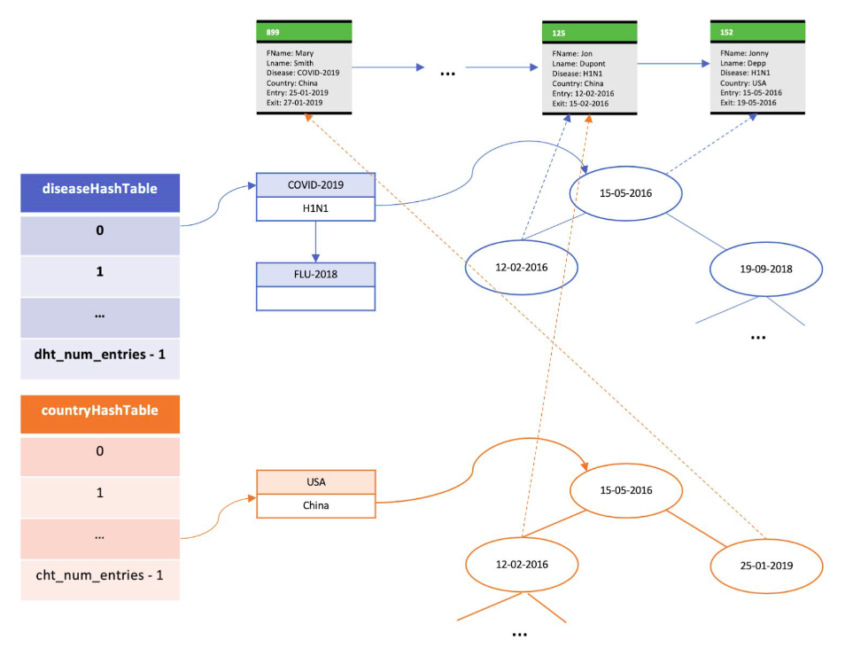

# Disease-Monitor
Implementation of a Multi-threaded TCP  Server &amp; Client Setup for Disease Data Retrieval following a Custom Communication Protocol 🖥

This project is an implementation of the typical [Client Server Model](https://en.wikipedia.org/wiki/Client%E2%80%93server_model). In our case,
server is made out of a group of worker servers, each one responsible for a part of the traction. They execute the actual requests, while the main server domain receives and distributes them to the corresponding workers.

Each worker has a copy of the initial patients actions database (stored in `/database`
and produced by a [Shell Script](https://en.wikipedia.org/wiki/Shell_script) which is not included in the project) and stores it in custom,
highly efficient data structures.

A wide variety of queries is posed by a multi-threaded Client Program, received by the main server domain, passed to
the responsible workers and the answers are sent back to the client. All of three main project components can be run on the same or three different
devices, as connection is [TCP](https://en.wikipedia.org/wiki/Transmission_Control_Protocol) based and [Sockets](https://www.techtarget.com/whatis/definition/sockets) defined by the user.

## Execution & Compilation:

First, a file containing the queries to be posed, has to be produced. It is done by executing the following python script:  
`python3 queries.py --queryFile <Target Queries File> --numQueries <Queries Number> --commandsFile <Queries Format File> --countriesFile <Countries List File> --diseasesFile <Diseases List File> --startDate <Start Date: DD-MM-YY> --endDate <End Date: DD-MM-YY>`

In order to compile the source code, type: `make`. It can take a **substantial amount of time**!  
After successful compilation, three executable files are produced. They have to be executed in the following order and manner:
* **`whoServer`**
* **`master`**
* **`whoClient`**

## Server:

Set up *Server* by typing: `./whoServer -q <Listening Port> -s <Statistics Port> -w <Threads Number> -b <Buffer Size>`  

Server has a **Listening Port**, which is used to receive queries from the Client Process. It also owns a **Statistics Port**, that is used
to receive the statistics from the Worker Processes. The number of **Total Threads** that handle the reception and response
to the posed queries is specified. Finally, user gives the size of the [Circular Buffer](https://en.wikipedia.org/wiki/Circular_buffer), that is used to store information about the incoming query requesters. Server attempts to establish communication with the Worker Processes and listens to both
ports for workers' positive response, client queries, workers' answers and sends them to the client processes.

## Master:

Set up *Master* by typing: `./master -w <Workers Number> -b <Buffer Size> -i <Input Directory> -s <Server IP>  -p <Server Port>`  

Master Process initializes the requested number of Workers Processes, which now behave as independent servers. Sends them all the necessary information,
allowing them to traverse the `/database` folder (which contains countries subfolders with patient actions with specific diseases) and store its copy locally in efficient, custom data structures. Each worker has two [Hash-Tables](https://en.wikipedia.org/wiki/Hash_table) for countries and diseases respectively. Their entries point to [AVL-Trees](https://en.wikipedia.org/wiki/AVL_tree) with their nodes being the patient actions per country and disease respectively. Communication is done through [IPC Pipes](https://www.geeksforgeeks.org/ipc-technique-pipes/). Subsequently, Master Process is only responsible for safe worker termination and memory deallocation.

## Client:

Set up *Client* by typing: `./whoClient -q <Query File> -w <Threads Number> -sp <Server Port> -sip <Server IP>`  

Client initializes a group of processes that read queries from the **Queries File**, parse them to the server and print the received answer.

## Termination:

All of the developed programs have an extensive collection of **Signal Handling** checks. This means, we can terminate (`SIGKILL`) and stop (`SIGSTOP`)
the corresponding executables without the danger of memory leaks! Nevertheless, in order to terminate the setup correctly, we press `CTRL+C` on
**Client**, **Master** and finally **Server**. All the allocated resources, including IPC Pipes, Shared Memory, Sockets and Data Structures are fred.

### Further Information:

We include a **readME** PDF file that contains an extensive description of the project set up, explanation of design choices and data structures.
This PDF is written in Greek!

*This project is part of the course: System Programming , Spring of 2020. University of Athens, DiT.*
